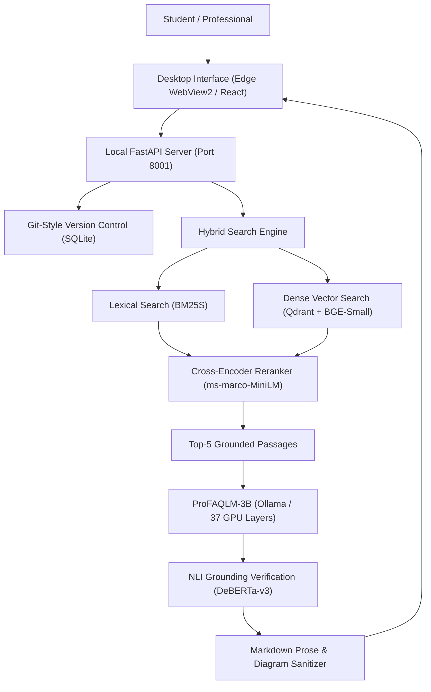
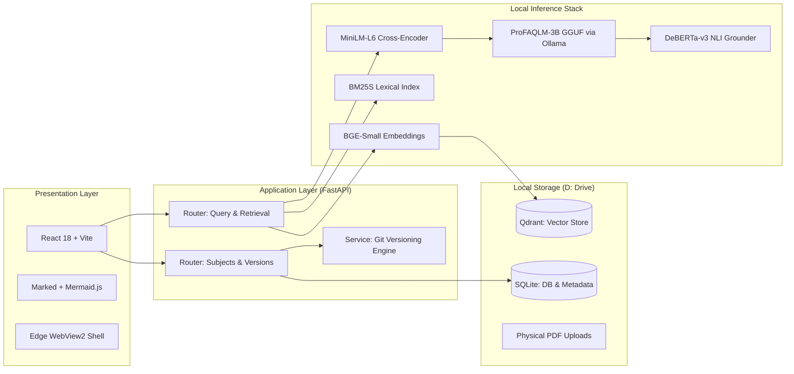
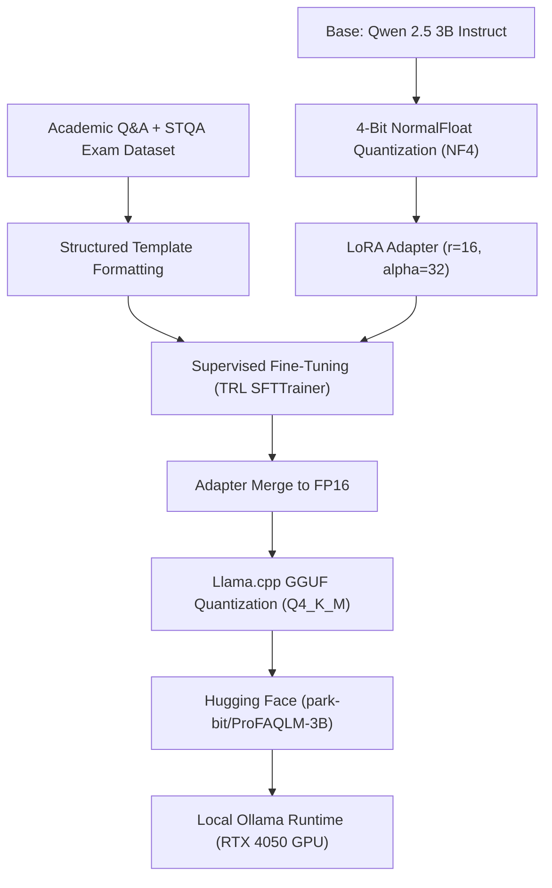
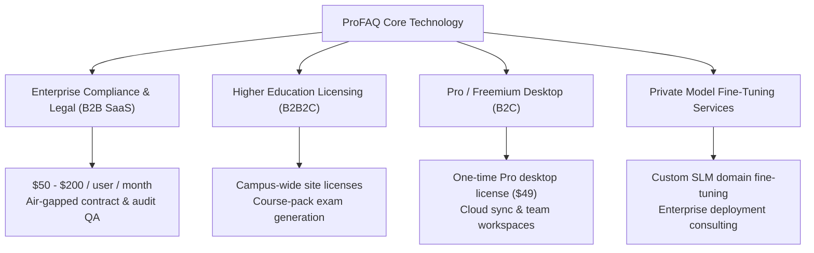

# ProFAQ & ProFAQLM: Project Story, Technical Architecture, and Business Strategy

An executive guide, interview walkthrough, and architectural breakdown of the local-first academic document intelligence platform.

---

## 1. Executive Summary

ProFAQ is a local-first, privacy-native document question-answering and exam synthesis platform. It is engineered specifically for students, university faculty, legal teams, and compliance professionals who require verifiable, page-level grounded answers without cloud subscription fees or data exposure.

Unlike general chatbots that hallucinate external facts or require expensive monthly subscriptions, ProFAQ operates on three fundamental pillars:
1. **Zero Cloud Inference Costs**: Powered by a custom fine-tuned Small Language Model (SLM), **ProFAQLM-3B**, running locally on consumer laptops (RTX 4050/3060) with sub-second response times and 0 MB cloud footprint.
2. **Verifiable Academic Provenance**: Every sentence is backed by inline page citations `[1]`, `[2]` and verified by an on-device Natural Language Inference (NLI) model that scores real-time factual grounding.
3. **Git-Style Document Version Control**: Users can branch their subject knowledge base, commit document revisions, diff document changes across semesters, and query specific historical commits without breaking past conversational threads.

---

## 2. The Origin Story: Why ProFAQ Was Created

### The Real-World Pain Point
Modern higher education and professional examinations (engineering, law, medicine, finance) present three major hurdles when using generative AI:

1. **The Hallucination & Citation Problem**: 
   When students ask ChatGPT or Claude to explain a university concept, the model pulls from general web crawls. It often invents definitions, mixes up syllabus terminology, or provides answers outside the course textbook. In university exams, writing a generic definition instead of the textbook-prescribed standard results in lost marks. Furthermore, ChatGPT cannot point to the exact page of a 400-page syllabus PDF where the claim originated.

2. **The Dynamic Syllabus Problem (Lack of Versioning)**:
   Course materials change every semester. A professor adds an updated chapter on distributed consensus, removes an outdated networking algorithm, or releases an errata sheet. In traditional AI tools, uploading a new PDF creates confusion: answers mix old and new editions. There is no concept of a "commit" or "branch" to compare how answers change between textbook Edition 4 and Edition 5.

3. **Privacy, Compliance, and Economic Barriers**:
   Universities and students in emerging markets face recurring SaaS subscription costs ($20/month for ChatGPT Plus or Claude Pro is prohibitive for millions of students). At the enterprise level, universities and corporate law departments cannot upload proprietary study banks, unpublished research, or confidential case briefs to external cloud APIs due to GDPR, FERPA, and corporate IP compliance rules.

### The Vision
ProFAQ was built to prove that a modern consumer laptop can run a private, high-accuracy document intelligence system that produces structured, top-tier academic answers, enforces Git-like version control on documents, and runs 100% offline with zero recurring operational cost.

---

## 3. How ProFAQ Was Built: Technical Architecture

ProFAQ follows a decoupled, micro-modular architecture consisting of a native desktop shell, a high-performance Python FastAPI service, embedded databases, a dual-retrieval pipeline, and a dedicated local language model.

### 1. Presentation Layer
- **Framework**: React 18, Vite, Vanilla CSS design system (dark noir aesthetic inspired by Linear and Raycast).
- **Interactive Markdown & Diagrams**: Uses `marked` with custom renderers and `mermaid.js` to dynamically draw architectural flowcharts and sequence diagrams directly inside chat responses.
- **Citation Badges**: Every citation like `[1]` or `[2]` is an interactive element. Clicking it opens a slide-over modal displaying the exact source snippet, file name, page number, and a direct link to open the PDF at that specific page.

### 2. Backend & Version Control Engine
- **FastAPI (Asynchronous Python)**: Handles document parsing, embeddings, search orchestration, and LLM streaming.
- **SQLite with SQLAlchemy Async Engine**: Stores subjects, branches, commits, document versions, chat threads, and query logs.
- **Branch & Commit Logic**:
  - Each subject starts with a `main` branch.
  - Uploading or deleting a PDF creates an immutable commit snapshot with a SHA hash.
  - Users can create branches (e.g., `midterm-prep` vs `final-exam`) and checkout past commits.
  - Queries are pinned to the active commit, ensuring 100% deterministic reproducibility.

### 3. Retrieval Pipeline: Hybrid Search + Cross-Encoder Reranking
Standard vector search often fails on technical acronyms (e.g., "STLC", "COCOMO", "FIFO", "B-Tree"). ProFAQ solves this using a two-stage hybrid pipeline:
- **Lexical Search (BM25S)**: Ultra-fast sparse keyword search for exact keyword and acronym matching.
- **Dense Vector Search (BAAI/bge-small-en-v1.5)**: 384-dimensional dense semantic embeddings running locally on CPU/GPU, indexed in embedded Qdrant.
- **Reciprocal Rank Fusion (RRF)**: Combines dense and sparse score ranks to pull the top 40 candidate passages.
- **Cross-Encoder Reranker (`cross-encoder/ms-marco-MiniLM-L-6-v2`)**: Compares the query and candidates simultaneously, filtering the list down to the 5 most semantically dense context chunks.

### 4. Hallucination Guardrail: NLI Entailment
Before presenting an answer, the generated claims are checked against retrieved chunks using `cross-encoder/nli-deberta-v3-small`. The system calculates a Grounding Score (0% to 100%). If the model makes unsubstantiated claims, the score drops, and a warning badge alerts the user.

---

## 4. The Custom Model: ProFAQLM-3B

To make local execution viable for ordinary students and professionals, relying on cloud APIs (Groq, OpenAI) was insufficient. The core innovation of the project is **ProFAQLM-3B**, a fine-tuned Small Language Model (SLM).

### Why a 3B Model Instead of 7B or 70B?
- **Hardware Constraints**: A 7B parameter model requires 6GB to 10GB of VRAM just for weights, causing out-of-memory errors on entry-level gaming laptops or student PCs. A 70B model requires enterprise server racks.
- **The Sweet Spot**: Qwen 2.5 3B Instruct has exceptional reasoning, multilingual proficiency, and coding ability. When quantized to 4-bit (`Q4_K_M`), the entire model takes only **1.80 GB of VRAM**.
- **Performance**: On an NVIDIA GeForce RTX 4050 Laptop GPU (6GB VRAM), all 37 layers offload entirely to GPU memory, generating answers at 45 to 60 tokens per second.

### Dataset & Training Methodology
1. **Dataset Sources**:
   - `allenai/sciq`: High-grade academic science reasoning.
   - Curated university exam papers, syllabus lecture notes, and Software Testing & Quality Assurance (STQA) coursework.
2. **Instruction Alignment Schema**:
   The model was trained to enforce strict university exam answer formatting:
   - **Formal Definition First**: Core concepts highlighted in bold (`**concept**`).
   - **Hierarchy**: Markdown headers (`##`, `###`) for distinct sections.
   - **High-Density Bullets**: Unpacked explanations instead of monolithic text walls.
   - **Comparative Tables**: Automatic Markdown comparison tables when contrasting two or more mechanisms.
   - **Visual Diagrams**: ASCII diagrams and Mermaid flowchart syntax for process flows.
   - **Inline Citations**: Synthesizing answers while citing context tags like `[1]`, `[2]`.

3. **Hyperparameters (QLoRA)**:
   - Precision: 4-bit NormalFloat (NF4) with double quantization.
   - LoRA Rank ($r$): 16.
   - LoRA Alpha ($\alpha$): 32.
   - LoRA Dropout: 0.05.
   - Target Modules: `q_proj`, `k_proj`, `v_proj`, `o_proj`, `gate_proj`, `up_proj`, `down_proj`.
   - Learning Rate: $2 \times 10^{-4}$ with cosine learning rate scheduler.
   - Batch Size: 2 per device with 4 gradient accumulation steps (effective batch size: 8).
   - Training Frameworks: Hugging Face Transformers, PEFT, TRL (`SFTTrainer`), and `bitsandbytes`.

4. **Quantization & Deployment**:
   - Trained on Kaggle dual T4 GPUs.
   - LoRA adapters merged back into base weights.
   - Converted to GGUF format using `llama.cpp` at `Q4_K_M` quantization.
   - Hosted publicly on Hugging Face: [park-bit/ProFAQLM-3B](https://huggingface.co/park-bit/ProFAQLM-3B).

---

## 5. Major Engineering Challenges & Solutions

During development, several complex real-world software engineering hurdles were encountered and resolved:

### Challenge 1: The Windows C: Drive Space Trap
- **Problem**: Machine learning libraries (`transformers`, `torch`, `huggingface_hub`) and Windows Edge WebView2 automatically dump cached weights and user data into `C:\Users\<user>\AppData` and `C:\Users\<user>\.cache`. On laptops with small SSD boot partitions, running models exhausted the C: drive within hours.
- **Solution**: Re-engineered all file pointers and environment variables across `Setup.bat`, `ProFAQ.bat`, and `backend/app/config.py`. Enforced `HF_HOME`, `TORCH_HOME`, `QDRANT_PATH`, `WEBVIEW2_USER_DATA_FOLDER`, and `TEMP`/`TMP` strictly to the project directory on `D:\Contributions\ProFAQ\data`. C: drive footprint was reduced to 0 MB.

### Challenge 2: Truncated JSON Output in Local Small Language Models
- **Problem**: When prompting Ollama with `format: "json"`, small 3B models often hit token limits before outputting the closing quote `"` and closing brace `}`. When standard `json.loads` encountered unescaped newlines or truncated brackets, it threw a decode error. A naive fallback dumped raw JSON strings like `{"answer": "#1\n## ..."` directly into the user interface.
- **Solution**: Built a multi-stage resilient parser in `generator.py` paired with frontend sanitization in `MarkdownView.jsx`. The pipeline uses regex extraction to salvage truncated text, strips leaked control tags, converts raw `\n` to real linebreaks, auto-formats inline bullets (`•`) into Markdown list items, and inserts double newlines around headings to produce a ChatGPT-style layout.

### Challenge 3: Port Collisions with Other Microservices
- **Problem**: Both ProFAQ and companion services (such as the Kompose travel orchestration engine) defaulted to port 8000. When Kompose launched, its launcher saw port 8000 occupied by ProFAQ, assumed its own backend was active, and routed requests to ProFAQ. ProFAQ returned `405 Method Not Allowed`.
- **Solution**: Implemented dynamic port auto-discovery in `run_app.py` scanning from port 8001 to 8050. ProFAQ frontend was refactored to use origin-relative API paths (`/subjects`, `/health`), allowing the app to run on any port without breaking client connections.

### Challenge 4: Ephemeral Desktop State Resets
- **Problem**: In embedded WebView2 environments, browser `localStorage` can be cleared between sessions or isolated in private containers. Users found their configured LLM providers and API keys resetting every time the application reopened.
- **Solution**: Implemented a two-way synchronization bridge. Added `GET /subjects/llm/config` and `POST /subjects/llm/config` in FastAPI that reads from and writes to the persistent `.env` file on disk. When the frontend mounts, it reconciles `localStorage` with the disk configuration.

---

## 6. Competitive Landscape: ProFAQ vs Alternatives

| Feature / Dimension | Standard ChatGPT | Google NotebookLM | PrivateGPT / AnythingLLM | ProFAQ |
| :--- | :--- | :--- | :--- | :--- |
| **Hosting & Privacy** | 100% Cloud (OpenAI) | 100% Cloud (Google) | Local-First | **100% Local-First** |
| **Inference Cost** | $20/month per user | Free (data used by Google) | Depends on model | **$0 Forever (Open Source)** |
| **Document Version Control** | None (upload files only) | None (static sources) | None (flat vector store) | **Git-Style Branches, Commits, Diffs** |
| **Citation Precision** | Generic or fabricated | Block level | Chunk level | **Deterministic Page-Level Snippet Badges** |
| **Hallucination Verification** | None (model self-checks) | None | None | **On-Device NLI Entailment Scoring** |
| **Offline Execution** | Impossible | Impossible | Requires technical setup | **1-Click Windows Native Bundle (.exe)** |
| **Academic Exam Structuring** | Generic conversational prose | Podcast / summary focus | Generic Q&A | **Fine-Tuned Exam Layouts, Tables & Diagrams** |

### Why Not Just Use ChatGPT?
ChatGPT answers from general probability. If an engineering standard was updated in 2024, ChatGPT might still quote the 2018 edition from its pretraining data. ProFAQ enforces strict grounding: it only answers from the verified context passages loaded in the active commit.

### Why Not Just Use NotebookLM?
NotebookLM is cloud-only. Educational institutions, legal firms, and defense contractors cannot upload unreleased exams, patent applications, or student medical records to Google servers. NotebookLM also lacks document versioning: you cannot checkout commit `v1.0` to see what your syllabus looked like three months ago.

---

## 7. Business Model & Monetization Strategy

While ProFAQ is open source at its core, the technology has high commercial viability across multiple enterprise verticals:

### 1. Enterprise Legal and Regulatory Compliance (Air-Gapped QA)
- **Target Market**: Law firms, pharmaceutical research labs, audit consultancies, and financial compliance officers.
- **Value Proposition**: These organizations deal with sensitive NDAs, clinical trial dossiers, and SEC filings. Sending data to cloud APIs is a compliance violation. ProFAQ provides an air-gapped, on-premise document search platform with verifiable citations and audit trails.
- **Pricing**: $50 to $200 per seat per month for self-hosted enterprise deployments with LDAP/Active Directory integration.

### 2. Higher Education & Institutional Site Licenses
- **Target Market**: Universities, exam coaching institutions, and distance learning platforms.
- **Value Proposition**: Universities can package digital textbooks and lecture materials into pre-indexed ProFAQ repositories. Students get access to an AI tutor grounded strictly in their professor's slides, with zero hallucination risk.
- **Pricing**: Annual campus site license ($10,000 to $50,000 per university department).

### 3. Desktop Pro / Freemium Model
- **Free Tier**: Open-source desktop app, local Ollama SLM, unlimited local PDFs.
- **Pro Tier ($49 one-time or $9/month)**:
  - Multi-device encrypted sync.
  - Team collaboration (shared branches and commit histories).
  - Advanced export formats (LaTeX papers, Anki flashcard decks, interactive mock exams).

### 4. Zero Cloud COGS (Cost of Goods Sold) Advantage
Traditional AI SaaS startups run on negative or thin margins because every user prompt costs money on the OpenAI or Anthropic API. ProFAQ shifts computation to the client's GPU. The marginal cost of serving another user is **$0.00**, allowing unprecedented operating margins.

---

## 8. Future Roadmap: What Features Can Be Added Next?

1. **Multimodal Document Understanding**:
   - Integrate vision-capable SLMs (e.g., Qwen2-VL 2B) to parse complex diagrams, mathematical equations, circuits, and architectural blueprints directly from PDF scans.
2. **GraphRAG (Knowledge Graph Integration)**:
   - Extract entities and concept relationships from documents into a local graph database (e.g., Kuzu or Neo4j Lite), enabling queries that span multiple documents (e.g., "Compare the fault tolerance model in Chapter 2 with the consensus algorithm in Chapter 8").
3. **Automated Exam Generation Engine**:
   - Turn the system from Q&A into an active evaluator: generate customized university mock question papers, grading rubrics, and model answer keys with one click.
4. **Peer-to-Peer Document Sync**:
   - Use libp2p or local network mesh to allow study groups in the same lab or classroom to sync document commits and chat branches without an internet connection.

---

## 9. Interview Cheat Sheet: Rapid Answers for Recruiters & Executives

**Q1: What was your exact role and contribution in this project?**
> "I designed and engineered the entire system end-to-end: the FastAPI backend, the React frontend, the hybrid retrieval pipeline (BM25 + vector search + reranking), the Git-style document versioning engine, and the fine-tuning of the ProFAQLM-3B language model using QLoRA."

**Q2: Why did you fine-tune your own model instead of just calling GPT-4?**
> "Calling GPT-4 makes an application a generic wrapper with high operational costs and privacy liabilities. Fine-tuning a 3B parameter model allowed us to teach the model our exact academic formatting standards (definitions, structured bullets, comparison tables) while enabling the entire platform to run 100% offline on consumer laptops with zero API fees."

**Q3: How do you guarantee the model does not hallucinate?**
> "We use a three-tier defense: First, hybrid retrieval with cross-encoder reranking feeds only the top 5 relevant passages. Second, the system prompt strictly forbids prior knowledge. Third, after generation, an on-device DeBERTa NLI cross-encoder scores factual entailment against the source chunks, providing a visible grounding metric to the user."

**Q4: What is your primary competitive moat?**
> "Our moat lies at the intersection of local privacy, document version control, and domain-tuned SLMs. Generic chat tools cannot branch a textbook, travel back to a previous syllabus commit, verify claims on-device, or run without an internet connection."
